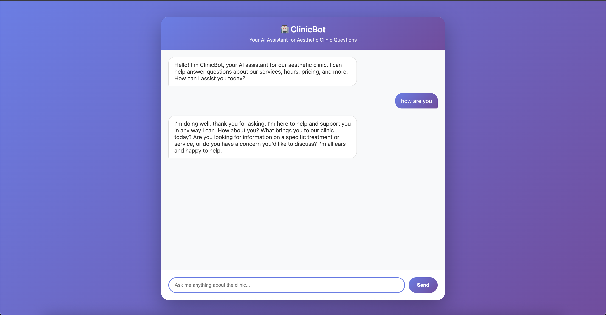
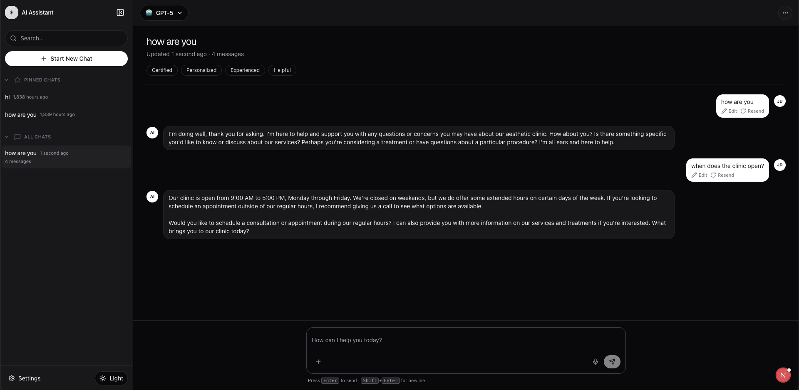

# AI Medical Clinic Assistant - RAG Chatbot

A full-stack AI-powered chatbot application for medical clinic FAQs, built with **Retrieval-Augmented Generation (RAG)** using LangChain, Pinecone, and Groq LLM.

Deploy Link: (http://52.91.160.51:8080/)

**Two deployment options:**
- 🚀 **Flask App** (Production) 
- 💻 **Next.js + FastAPI** (Development)


---

## 📋 Table of Contents

- [Features](#-features)
- [Demo](#-demo)
- [Architecture](#-architecture)
- [Architecture Decision: Why Flask?](#-architecture-decision-why-flask)
- [Technology Stack](#-technology-stack)
- [Prerequisites](#-prerequisites)
- [Installation](#-installation)
- [Configuration](#-configuration)
- [Running the Application](#-running-the-application)
- [Docker Deployment](#-docker-deployment)
- [CI/CD Deployment](#-cicd-deployment)
- [Project Structure](#-project-structure)
- [API Documentation](#-api-documentation)
- [Knowledge Base](#-knowledge-base)
- [Troubleshooting](#-troubleshooting)

---

## ✨ Features

### Core RAG Capabilities
- 🤖 **Retrieval-Augmented Generation (RAG)** - Accurate answers from clinic FAQ knowledge base
- 🔍 **Semantic Search** - Pinecone vector database with Google Generative AI embeddings
- 💬 **Streaming Responses** - Real-time LLM responses using Groq's Llama 3.3 70B
- 🛡️ **Robust Error Handling** - Comprehensive exception handling and logging
- ⚡ **Optimized Performance** - Singleton services, connection pooling, and caching

### ( Flask App ) or ( Next.js + FastAPI  ) 
- 💬 **Multi-Conversation Management** - Create, switch, and manage multiple chat conversations
- 📌 **Pin Important Chats** - Pin frequently used conversations for quick access
- 🔄 **Auto-Save Conversations** - Automatic persistence to localStorage
- 🎨 **Modern UI/UX** - Clean, responsive design with dark/light theme support
- ⚡ **Real-time Streaming** - Live streaming of AI responses with typing indicators
- �🔍 **Search Functionality** - Search through conversation history

---

## 🎥 Demo

### Flask App Interface (Production)


### Next.js + FastAPI Interface (Development)


### Chat Interface Features
- Auto-created chat on first load
- Real-time streaming responses
- Conversation history in sidebar
- Pin/unpin conversations
- Dark/light theme toggle

### Key Capabilities
- Answer clinic-specific questions (hours, pricing, services)
- Provide accurate information from FAQ knowledge base
- Handle follow-up questions with context
- Stream responses in real-time

---

## 🏗️ Architecture

### Production (Flask App)
```
┌─────────────────────────────┐
│      Flask Application      │
│  (UI + API on Port 8080)    │
│                             │
│  ┌──────────┐  ┌─────────┐ │
│  │Templates │  │   API   │ │
│  │  (HTML)  │  │Endpoints│ │
│  └──────────┘  └─────────┘ │
└──────────────┬──────────────┘
               │
    ┌──────────┴────┬──────────┬──────────┐
    ▼               ▼          ▼          ▼
┌────────┐      ┌─────┐    ┌──────┐  ┌──────┐
│Pinecone│      │Groq │    │Google│  │ FAQ  │
│Vector  │      │ LLM │    │Embed │  │ JSON │
│  DB    │      │     │    │      │  │      │
└────────┘      └─────┘    └──────┘  └──────┘
```

### Development (Next.js + FastAPI - Optional)
```
┌─────────────────┐
│   Next.js UI    │
│  (Port 3000)    │
└────────┬────────┘
         │ HTTP/SSE
         ▼
┌─────────────────┐
│  FastAPI Server │
│  (Port 8000)    │
└────────┬────────┘
         │
    ┌────┴────┬──────────┬──────────┐
    ▼         ▼          ▼          ▼
┌────────┐ ┌─────┐  ┌──────┐  ┌──────┐
│Pinecone│ │Groq │  │Google│  │ FAQ  │
│Vector  │ │ LLM │  │Embed │  │ JSON │
│  DB    │ │     │  │      │  │      │
└────────┘ └─────┘  └──────┘  └──────┘
```

**RAG Pipeline:**
1. User query → Embedded using Google Generative AI
2. Semantic search in Pinecone vector database
3. Top-K relevant FAQ chunks retrieved
4. Context + Query sent to Groq LLM (Llama 3.3 70B)
5. Streaming response back to frontend

---

## 🎯 Architecture Decision: Why Flask?

### Prioritizing Rapid Delivery and Simplicity

This project was initially developed with a **Next.js + FastAPI** architecture, offering a modern, decoupled frontend-backend setup. However, after evaluating the project requirements and deployment goals, **Flask was chosen as the primary production deployment option**.

### Key Reasons for This Decision

**1. Focus on Core Functionality**
- The primary goal was to deliver a working RAG chatbot quickly and efficiently
- Flask's monolithic architecture allowed faster iteration and deployment
- Reduced complexity meant more time spent on RAG quality, prompt engineering, and user experience

**2. Simplified Deployment & Operations**
- **Single container deployment** - One Docker image instead of coordinating multiple services
- **Reduced infrastructure complexity** - No need to manage separate frontend/backend services
- **Lower operational overhead** - Easier monitoring, logging, and debugging
- **Faster CI/CD pipeline** - Single build and deployment process

**3. Appropriate for Project Scale**
- For a medical clinic FAQ chatbot, Flask's capabilities are more than sufficient
- Server-side rendering with Jinja2 templates provides excellent performance
- No need for complex client-side state management or routing

**4. Development Efficiency**
- Flask's simplicity allowed rapid prototyping and feature development
- Fewer moving parts meant faster debugging and iteration cycles
- Single codebase for both UI and API reduced context switching

### Next.js + FastAPI: Still Available for Development

The **Next.js + FastAPI** setup remains in the codebase as an **optional development path** but only able to run locally:
- Modern React-based UI development
- Decoupled frontend/backend architecture
- TypeScript and Tailwind CSS workflow
- Advanced client-side features

### The Pragmatic Engineering Approach

This decision reflects a **pragmatic engineering philosophy**:
- ✅ Ship working software quickly
- ✅ Choose the simplest solution that meets requirements
- ✅ Optimize for maintainability and operational simplicity
- ✅ Avoid over-engineering for hypothetical future needs

The Flask-based architecture delivers all core features—RAG retrieval, streaming responses, conversation management, and a clean UI—while maintaining simplicity and ease of deployment.

---

## 🛠️ Technology Stack

### Production Stack (Flask App)
- **Framework:** Flask 3.0+ (Python 3.11+)
- **UI:** HTML5, CSS3, Vanilla JavaScript
- **LLM:** Groq (Llama 3.3 70B Versatile)
- **Embeddings:** Google Generative AI (models/embedding-001, 768 dimensions)
- **Vector Database:** Pinecone (serverless, us-east-1)
- **RAG Framework:** LangChain
- **Configuration:** Pydantic Settings
- **Logging:** Loguru
- **Deployment:** Docker, GitHub Actions, AWS ECR/EC2

### Development Stack (Next.js + FastAPI - Optional)
- **Backend Framework:** FastAPI (Python 3.11+)
- **Frontend Framework:** Next.js 15.2 (React 19)
- **Language:** TypeScript
- **Styling:** Tailwind CSS 4
- **Animations:** Framer Motion
- **Icons:** Lucide React
- **HTTP Client:** Fetch API with SSE support

---

## 📦 Prerequisites

Before you begin, ensure you have the following installed:

### Required Software
- **Python:** 3.11 or higher ([Download](https://www.python.org/downloads/))
- **Node.js:** 18.0 or higher ([Download](https://nodejs.org/))
- **pnpm:** Latest version 
- **Git:** For cloning the repository

### Required API Keys
You'll need to sign up for the following services (all have free tiers):

1. **Google AI Studio** (for embeddings)
   - Sign up: https://makersuite.google.com/app/apikey
   - Get your API key from the dashboard

2. **Groq** (for LLM)
   - Sign up: https://console.groq.com/
   - Create an API key in the dashboard

3. **Pinecone** (for vector database)
   - Sign up: https://www.pinecone.io/
   - Note your API key and environment

4. **Clerk** (optional, for authentication)
   - Sign up: https://clerk.com/
   - Create a new application
   - Get your publishable and secret keys

---

## 🚀 Installation

### 1. Clone the Repository

```bash
git clone https://github.com/yourusername/mcp-rag-chatbot.git
cd mcp-rag
```

### 2. Backend Setup

```bash
# Navigate to server directory
cd server

# Create virtual environment
python -m venv venv

# Activate virtual environment
source venv/bin/activate

# using uv:
uv pip install -r requirements.txt
```

### 3. Frontend Setup

```bash
# Navigate to frontend directory
cd client/mcp_rag

# Install dependencies using pnpm
pnpm install

```

---

## ⚙️ Configuration

### 1. Backend Environment Variables

Create a `.env` file in the `server/` directory:

```bash
cd server
cp .env.example .env
```

Edit `server/.env` with your API keys:

```env
# Required API Keys
GOOGLE_API_KEY=your_google_ai_studio_api_key_here
GROQ_API_KEY=your_groq_api_key_here
PINECONE_API_KEY=your_pinecone_api_key_here

# Pinecone Configuration
PINECONE_INDEX_NAME=clinic-faqs
PINECONE_ENV=us-east-1

# Optional: Model Configuration (defaults shown)
# EMBEDDING_MODEL=models/embedding-001
# EMBEDDING_DIMENSION=768
# LLM_MODEL=llama-3.3-70b-versatile
# CHUNK_SIZE=500
# CHUNK_OVERLAP=100
```

### 2. Frontend Environment Variables (Optional)

If using Clerk authentication, create `client/mcp_rag/.env.local`:

```env
NEXT_PUBLIC_CLERK_PUBLISHABLE_KEY=your_clerk_publishable_key
CLERK_SECRET_KEY=your_clerk_secret_key
```

---

## 🏃 Running the Application

### Option 1: Flask App (Recommended - Simple & Fast)

**Single terminal needed:**

```bash
cd server

# Activate virtual environment if not already activated
source venv/bin/activate  # macOS/Linux

# Start Flask application
python flask_app.py
```

**Expected output:**
```
 * Serving Flask app 'flask_app'
 * Debug mode: on
 * Running on http://0.0.0.0:3000
```

Application will be available at: **http://localhost:3000**

---

### Option 2: Next.js + FastAPI (Full Development Setup)

**Two terminal windows needed:**

#### Terminal 1: Start Backend Server

```bash
cd server

# Activate virtual environment if not already activated
source venv/bin/activate  # macOS/Linux

# Start FastAPI server
uvicorn main:app --reload
```

**Expected output:**
```
INFO:     Uvicorn running on http://127.0.0.1:8000 (Press CTRL+C to quit)
INFO:     Started reloader process
INFO:     Started server process
INFO:     Waiting for application startup.
INFO:     Application startup complete.
```

Backend will be available at: **http://localhost:8000**

#### Terminal 2: Start Frontend Server

```bash
cd client/mcp_rag

# Start Next.js development server
pnpm dev
```

**Expected output:**
```
  ▲ Next.js 15.2.4
  - Local:        http://localhost:3000
  - Turbopack:    enabled

 ✓ Ready in 2.5s
```

Frontend will be available at: **http://localhost:3000**

**Features:**
- ✅ Full Next.js development experience
- ✅ Multi-conversation management
- ✅ Pin/unpin conversations
- ✅ Search functionality

---

### Flask App (Production)


**Note:** The production Docker deployment uses port 8080 (while the development uses port 3000).

---

## 🚀 CI/CD Deployment

Automated deployment to AWS EC2 using GitHub Actions.

### Quick CI/CD Setup

**Prerequisites:**
- AWS account with ECR and EC2 access
- EC2 instance configured as GitHub self-hosted runner
- GitHub repository secrets configured

**Workflow:**
1. Push code to `main` or `master` branch (or trigger manually)
2. GitHub Actions automatically builds Flask Docker image
3. Image pushed to Amazon ECR
4. Deployed to EC2 using `docker run`


**Access your deployed app:**
```
http://YOUR_EC2_IP:8080
```


---

## 📁 Project Structure

```
mcp-rag-chatbot/
├── server/                          # Backend
│   ├── flask_app.py                 # 🚀 Flask application (PRODUCTION)
│   ├── main.py                      # FastAPI application (development only)
│   ├── config.py                    # Centralized configuration (Pydantic)
│   ├── logger.py                    # Logging configuration
│   ├── prompts.py                   # LLM prompt templates
│   ├── requirements.txt             # Python dependencies
│   ├── .env.example                 # Environment variables template
│   │
│   ├── templates/                   # Flask HTML templates
│   │   └── index.html               # Chat interface UI
│   │
│   ├── static/                      # Flask static files
│   │   └── chat.js                  # Chat JavaScript
│   │
│   ├── data/
│   │   └── clinic_faqs.json         # FAQ knowledge base
│   │
│   ├── services/
│   │   ├── vectorstore_service.py   # Pinecone vector store
│   │   └── llm_service.py           # LLM service factory
│   │
│   ├── routes/                      # FastAPI routes (development only)
│   │   ├── ask_question.py          # POST /ask/ - RAG query endpoint
│   │   └── groq_stream.py           # POST /groq_stream/ - Streaming endpoint
│   │
│   ├── modules/
│   │   ├── faq_loader.py            # Load FAQs from JSON
│   │   ├── query_handlers.py        # Query processing logic
│   │   └── load_vectorstore.py      # Vector store initialization
│   │
│   ├── middlewares/                 # FastAPI middleware (development only)
│   │   └── exception_handlers.py    # Global exception handling
│   │
│   └── tests/
│       ├── test_rag_retrieval.py    # RAG system tests
│       └── test_results.json        # Test results
│
├── client/mcp_rag/                  # Frontend (Next.js - development only)
│   ├── app/
│   │   ├── layout.tsx               # Root layout with Clerk provider
│   │   ├── page.tsx                 # Home page
│   │   └── globals.css              # Global styles
│   │
│   ├── components/
│   │   ├── AIAssistantUI.jsx        # Main chat interface
│   │   ├── Sidebar.jsx              # Conversation sidebar
│   │   ├── ChatPane.jsx             # Chat message display
│   │   ├── Composer.jsx             # Message input component
│   │   ├── Message.jsx              # Individual message component
│   │   ├── ConversationRow.jsx      # Sidebar conversation item
│   │   ├── Header.jsx               # Chat header
│   │   ├── SearchModal.jsx          # Search conversations
│   │   ├── SettingsPopover.jsx      # Settings menu
│   │   └── ThemeToggle.jsx          # Dark/light theme toggle
│   │
│   ├── lib/
│   │   └── api.ts                   # API client functions
│   │
│   ├── package.json                 # Node.js dependencies
│   └── next.config.ts               # Next.js configuration
│
├── .github/
│   └── workflows/
│       └── deploy.yml               # GitHub Actions CI/CD workflow
│
├── Dockerfile                       # Docker configuration for Flask app
├── .gitignore                       # Git ignore rules
└── README.md                        # This file
```

**Key Files:**
- 🚀 **`server/flask_app.py`** - Production Flask application (deployed)
- 📄 **`server/templates/index.html`** - Chat UI template
- 📜 **`server/static/chat.js`** - Client-side chat logic
- 🐳 **`Dockerfile`** - Single container for Flask app
- ⚙️ **`.github/workflows/deploy.yml`** - CI/CD pipeline

---

## 🔌 API Documentation

### Base URLs

**Flask App (Production):**
```
Local: http://localhost:3000
Production: http://YOUR_EC2_IP:8080
```

**FastAPI (Development):**
```
http://localhost:8000
```

### Endpoints

#### Flask App Endpoints

**GET /** - Chat Interface
- Returns HTML chat interface
- Access via browser

**GET /health** - Health Check
```bash
curl http://localhost:3000/health
```

**POST /groq_stream** - Streaming Chat
```bash
curl -X POST "http://localhost:3000/groq_stream" \
  -F "question=Tell me about your services" \
  -F "thread_id=my-conversation"
```
- Returns: Server-Sent Events (SSE) stream
- Parameters:
  - `question` (required): User's question
  - `thread_id` (optional): Conversation thread ID for context

#### FastAPI Endpoints (Development Only)

**POST /ask** - RAG Query
```bash
curl -X POST "http://localhost:8000/ask" \
  -F "question=What are your hours?"
```
- Returns: JSON with response and sources

**POST /groq_stream** - Streaming Chat
```bash
curl -X POST "http://localhost:8000/groq_stream" \
  -F "question=Tell me about your services" \
  -F "thread_id=my-conversation"
```
- Returns: Server-Sent Events (SSE) stream

---

## 📚 Knowledge Base

### FAQ Structure

The knowledge base is stored in `server/data/clinic_faqs.json` with the following structure:

```json
{
  "faqs": [
    {
      "id": "faq_001",
      "question": "What are your operating hours?",
      "answer": "Our clinic is open Monday through Friday...",
      "category": "General Information",
      "tags": ["hours", "schedule", "availability"]
    }
  ]
}
```


### Current FAQ Categories

- **General Information** - Hours, location, contact
- **Appointments** - Booking, walk-ins, scheduling
- **Billing & Payment** - Payment methods, financing
- **Facilities** - Parking, accessibility
- **Treatments** - Laser hair removal, Botox, etc.
- **Safety & Credentials** - Certifications, safety
- **Consultations** - Free consultations, assessments
- **First Visit** - Preparation, what to bring
- **Policies** - Cancellation, rescheduling

### Embedding Strategy

Each FAQ is embedded as a complete unit:
```
Question: {question}
Answer: {answer}
Category: {category}
```

This ensures:
- Complete context in each chunk
- High retrieval accuracy
- Relevant answers to user queries

---

## 🐛 Troubleshooting

### Common Issues

#### 1. "Module not found" errors

**Problem:** Python dependencies not installed

**Solution:**
```bash
cd server
uv pip install -r requirements.txt
```

#### 2. "GOOGLE_API_KEY not found"

**Problem:** Environment variables not set

**Solution:**
```bash
# Check if .env file exists
ls server/.env

# If not, create it from template
cp server/.env.example server/.env

# Edit with your API keys
nano server/.env
```


#### 4. Frontend can't connect to backend

**Problem:** CORS or backend not running

**Solution:**
```bash
# Check backend is running on port 8000
curl http://localhost:8000

# Check CORS settings in server/config.py
# Ensure http://localhost:3000 is in CORS_ORIGINS
```

#### 5. "Rate limit exceeded" errors

**Problem:** API rate limits hit

**Solution:**
- Wait a few minutes before retrying
- Check your API quotas in respective dashboards
- Consider upgrading to paid tiers for higher limits

#### 6. Conversations not persisting

**Problem:** localStorage not working

**Solution:**
- Check browser console for errors
- Clear browser cache and reload
- Ensure localStorage is enabled in browser settings

---
